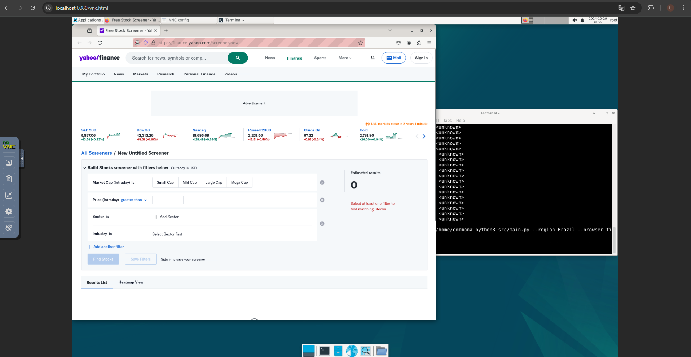
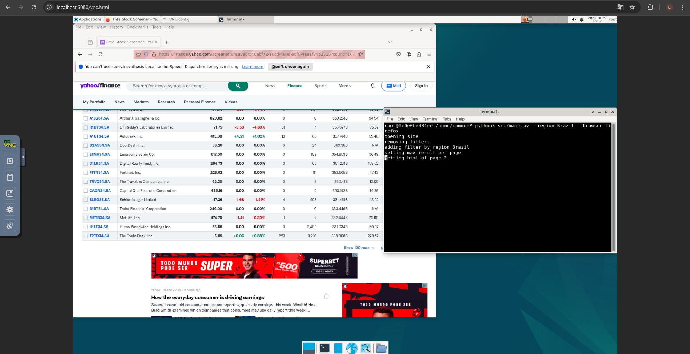
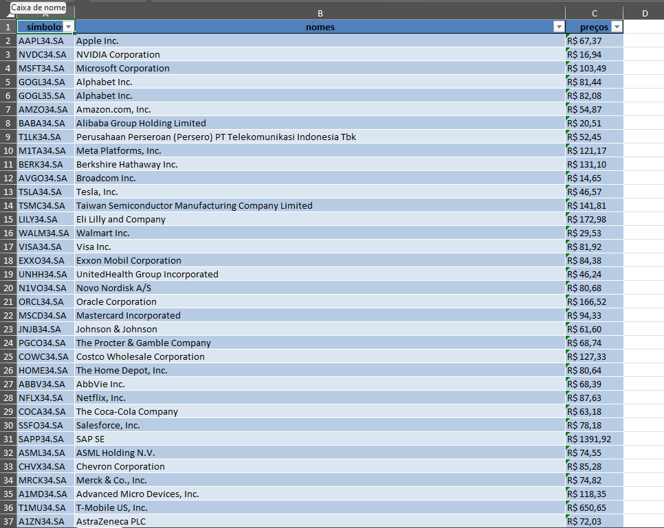

# rpa-stock-exchange-yahoo


# Sobre o projeto

Projeto teste para: VERX (Serasa S.A.)

Este projeto tem como objetivo desenvolver um crawler utilizando Selenium para capturar informações financeiras diretamente da página do Yahoo Finance Screener (https://finance.yahoo.com/screener/new). O foco é automatizar a coleta de dados específicos, extraindo determinadas colunas de interesse e salvando-as em uma planilha para facilitar a análise e o acompanhamento de informações financeiras.








## Ajustes e melhorias

- [x] criar crawler para captura do html
- [x] extrair informações especificas de: 
    - nomes (name) 
    - símbolos (symbol)
    - preços (price (intraday))
- [x] salvar informações em planilha excel
- [] corrigir problema processamento no chrome
- [] melhorar tempo de performance

## Como executar: sem docker
Pré-Requisito: 
- Python 3.10+
- firefox
- chrome: 130

```bash
git clone https://github.com/LeviCesar/rpa-stock-exchange-yahoo.git

cd rpa-stock-exchange-yahoo.git

python3 -m venv env
source env/bin/activate
python -m pip install -r requirements.txt

python main.py --region <ex: Brazil> --browser <ex: chrome|firefox>
```

## Como executar com docker
Pré-requisitos: 
- docker
- docker compose

```bash
git clone https://github.com/LeviCesar/rpa-stock-exchange-yahoo.git

cd rpa-stock-exchange-yahoo.git

docker compose up -d --build

python main.py --region <ex: Brazil> --browser <ex: chrome|firefox>
```

Acesse o ambiente vnc pelo browser:
- http://localhost:6080/vnc.html
- senha: common 

```bash
# rode esse comando no terminal dentro do vnc
python main.py --region <ex: Brazil> --browser <ex: chrome|firefox>
```

## 📫 Contribuindo para rpa-stock-exchange-yahoo

Para contribuir com lol-matchups-crawler, siga estas etapas:

1. Bifurque este repositório.
2. Crie um branch: `git checkout -b <nome_branch>`.
3. Faça suas alterações e confirme-as: `git commit -m '<mensagem_commit>'`
4. Envie para o branch original: `git push origin <nome_do_projeto> / <local>`
5. Crie a solicitação de pull.

Como alternativa, consulte a documentação do GitHub em [como criar uma solicitação pull](https://help.github.com/en/github/collaborating-with-issues-and-pull-requests/creating-a-pull-request).


## 🤝 Autores & Colaboradores

<table>
  <tr>
    <td align="center">
      <a href="https://www.linkedin.com/in/levi-cesar-lima/" title="LinkedIn">
        <br>
        <sub>
          <b>Levi César</b>
        </sub>
      </a>
    </td>
  </tr>
</table>
